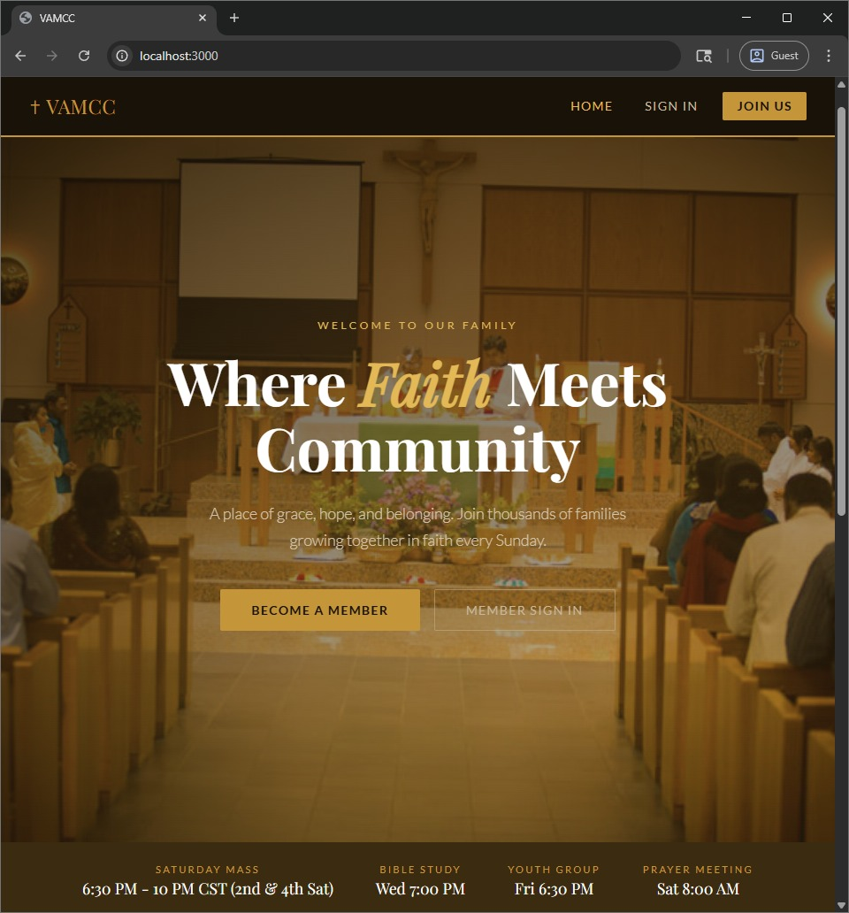
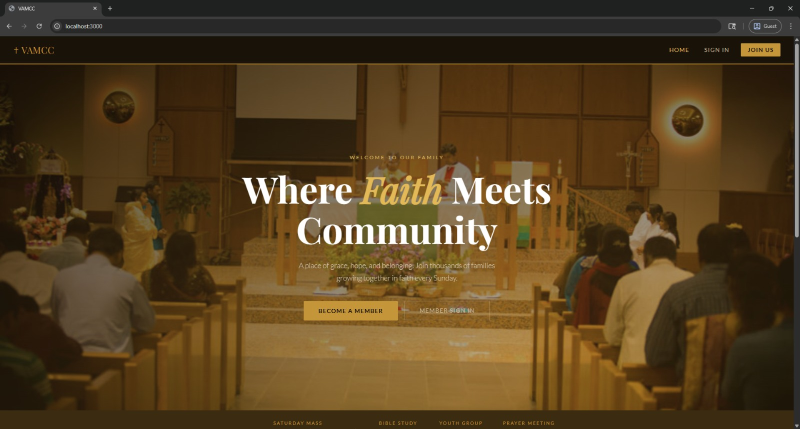
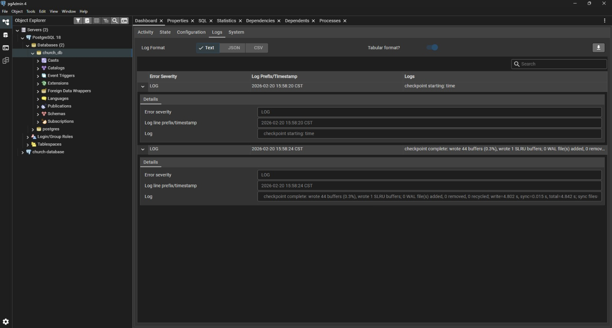
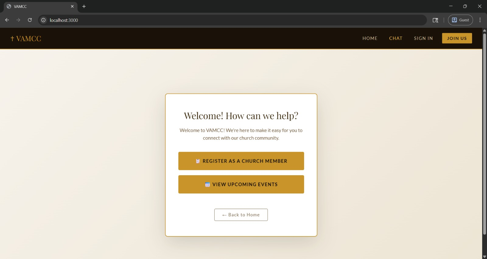
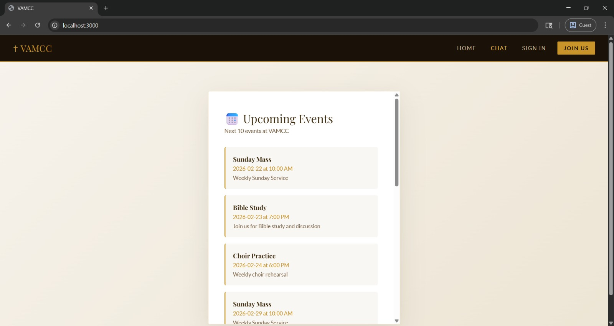

# VAMCC Church Website

A modern Progressive Web App (PWA) for VAMCC - a Tamil American Catholic community. Built with React, Spring Boot, and PostgreSQL.

## Features

✨ **Progressive Web App (PWA)**
- Installable on iOS home screen like a native app
- Works offline with service worker caching
- Full-screen app experience
- Responsive design optimized for mobile

👥 **Member Portal**
- User registration and member management
- Member profile management
- Secure database storage
- Duplicate member detection

📱 **Responsive Design**
- Mobile-first approach
- Works on all devices (mobile, tablet, desktop)
- Beautiful UI with gold and cream color scheme
- Optimized for iOS and Android

🎨 **Custom UI**
- Built-in styled components (no external UI library)
- Smooth animations and transitions
- Professional typography with Google Fonts

💬 **Member Registration Chatbot** *(New)*
- Virtual chatbot with member registration flow
- Duplicate phone number detection
- View and update existing member records
- Upcoming events display
- Stores member data securely in PostgreSQL

## Gallery - Church Website & Chatbot Feature

### Home Page - iOS Welcome Version

Responsive iOS mobile version of the church homepage welcome screen.

### Home Page - Desktop Widescreen

Full widescreen desktop version of the homepage showing complete layout and features.

### Database - pgAdmin Logs

PostgreSQL database logs and activity captured in pgAdmin management console.

### Database - Activity Monitor

Real-time database activity and query monitoring dashboard.

### Chatbot - Menu Options

Virtual chatbot interface displaying two main options: member registration and upcoming events.

### Chatbot - Member Registration Form

Chatbot member registration form collecting full name, phone, email, date of birth, and parish information.

### Chatbot - Upcoming Events

Chatbot showing list of 10 upcoming church events with dates, times, and descriptions.

## Technology Stack

### Frontend
- **React 18** - UI framework
- **Create React App** - Build tooling
- **ServiceWorker** - Offline functionality
- **PWA Manifest** - App configuration

### Backend
- **Spring Boot 3.2** - REST API framework
- **Java 17** - Programming language
- **Spring Data JPA** - Database access layer
- **PostgreSQL** - Database
- **Maven** - Build tool
- **Lombok** - Boilerplate reduction
- **CORS** - Cross-origin support

## Project Structure

```
church-website/
├── frontend/
│   ├── public/
│   │   ├── index.html          # Main HTML
│   │   ├── manifest.json       # PWA manifest
│   │   ├── service-worker.js   # Service worker for offline
│   │   └── icons/              # App icons (SVG)
│   ├── src/
│   │   ├── App.jsx             # Main React component
│   │   └── index.js            # React entry point
│   └── package.json
│
├── spring-api/
│   ├── src/main/
│   │   ├── java/com/vamcc/church/
│   │   │   ├── ChurchApiApplication.java   # Spring Boot entry point
│   │   │   ├── controller/                 # REST endpoints
│   │   │   ├── service/                    # Business logic
│   │   │   ├── repository/                 # Database access (JPA)
│   │   │   └── model/                      # Entity models
│   │   └── resources/
│   │       └── application.properties       # Spring Boot config
│   ├── pom.xml                   # Maven configuration
│   └── README.md
│
└── README.md
```

## Getting Started

### Prerequisites
- **Java 17+** - For Spring Boot
- **Node.js 16+** and npm - For React frontend
- **PostgreSQL 12+** - Database
- **Git** - Version control
- **Maven 3.8+** - Build tool (or use Maven wrapper)

### Local Development

**1. Setup Spring Boot Backend**
```bash
cd spring-api
# Update database credentials in src/main/resources/application.properties
spring.datasource.password=your_postgres_password
# Build and run
./mvnw clean install
./mvnw spring-boot:run
```

Backend runs on `http://localhost:8080/api`

**2. Setup React Frontend**
```bash
cd frontend
npm install
npm start
```

Frontend runs on `http://localhost:3000`

**3. Create Database**
```bash
createdb church_db
```

The Spring Boot API will auto-create the `members` table on first run via Hibernate.

## Deployment

### Frontend Deployment (GitHub Pages)

```bash
cd frontend
npm install --save-dev gh-pages
npm run deploy
```

Deployed at: `https://ngrifk98.github.io/vamcc-church-website/`

### Backend Deployment (Spring Boot on Cloud Platform)

**Option 1: Railway (Recommended)**
1. Go to [railway.app](https://railway.app)
2. Connect GitHub repository
3. Add PostgreSQL database service
4. Set environment variables in `application.properties`:
   - `spring.datasource.url=jdbc:postgresql://your-rails-db-url`
   - `spring.datasource.password=your_db_password`
5. Deploy

**Option 2: Docker Containerization**
```bash
# Build JAR
cd spring-api
./mvnw clean package

# Create Dockerfile and deploy to any cloud platform
```

### Domain Configuration

1. Purchase www.vamcc.org from registrar
2. Update DNS CNAME record to point to GitHub Pages
3. Enable custom domain in GitHub Pages settings

## API Endpoints

### Member Management
- `POST /api/members` - Add new member
- `GET /api/members` - List all members
- `GET /api/members/{id}` - Get member by ID
- `GET /api/members/email/{email}` - Get member by email
- `GET /api/members/phone/{phone}` - Get member by phone
- `GET /api/members?search={query}` - Search members by email, phone, or name
- `PUT /api/members/{id}` - Update member
- `DELETE /api/members/{id}` - Delete member

### Health Check
- `GET /api/members/health` - Server health status

### Base URL
- **Development:** `http://localhost:8080/api`
- **Production:** `https://your-deployed-url/api`

## Environment Variables

### Spring Boot Backend (application.properties)
Located in `spring-api/src/main/resources/application.properties`

```properties
# Database Configuration
spring.datasource.url=jdbc:postgresql://localhost:5432/church_db
spring.datasource.username=postgres
spring.datasource.password=your_postgres_password
spring.datasource.driver-class-name=org.postgresql.Driver

# Server Configuration
server.port=8080
server.servlet.context-path=/api

# JPA/Hibernate Configuration
spring.jpa.hibernate.ddl-auto=update
spring.jpa.show-sql=false
spring.jpa.properties.hibernate.dialect=org.hibernate.dialect.PostgreSQLDialect
```

### Frontend (.env)
```
REACT_APP_API_URL=http://localhost:8080/api
```

## Features & Pages

**Home Page**
- Hero section with church image
- Service times (Saturday Mass details)
- Church programs and ministries
- Member portal access

**Registration Page**
- Create new member account
- Input validation
- Error handling

**Login Page**
- Secure member login
- JWT token generation
- Session management

**Profile Page**
- View member information
- Edit profile details
- Member since date
- Role badge

## PWA Features

### Installation
1. On iOS: Safari → Share → Add to Home Screen
2. On Android/Chrome: Install app prompt
3. App opens in full-screen standalone mode

### Offline Support
- Service worker caches static assets
- API calls cached with smart strategies
- Works offline with cached data
- Auto-syncs when back online

## Building for Production

```bash
# Frontend
cd frontend
npm run build

# Creates optimized build in frontend/build folder
# Ready for GitHub Pages deployment
```

## Testing

### Local PWA Testing
```bash
# Build and serve locally
npm run build
npx serve -s build
```

Then visit `http://localhost:3000` and test:
- Add to home screen
- Offline functionality
- Navigation
- Authentication

## Troubleshooting

**Service Worker not updating?**
- Clear browser cache (Ctrl+Shift+R)
- Unregister service workers in DevTools
- Clear site data

**API not connecting?**
- Verify Spring Boot API is running: `http://localhost:8080/api/members/health`
- Check CORS settings in `MemberController.java`
- Ensure Java 17+ is installed: `java -version`
- Check database credentials in `application.properties`

**PostgreSQL connection error?**
- Ensure PostgreSQL is running
- Check DB credentials in `application.properties`
- Database should be pre-created: `createdb church_db`
- Use pgAdmin to verify connection

**Spring Boot build fails?**
- Ensure Java 17+ is installed: `java -version`
- Check Maven version: `mvn -v` (or use Maven wrapper `./mvnw`)
- Run `./mvnw clean install` to rebuild from scratch
- Check Lombok compatibility (should be 1.18.30+)

## Contributing

1. Clone the repository
2. Create a feature branch
3. Make your changes
4. Commit and push
5. Create a pull request

## License

This project is for VAMCC. All rights reserved.

## Contact

For questions or support, reach out to the development team.

---

## Spring Boot API Documentation

For detailed API documentation, request specifications, and integration examples, see [spring-api/README.md](./spring-api/README.md).

### Quick Start with Spring Boot
```bash
cd spring-api
./mvnw clean install        # Build the project
./mvnw spring-boot:run      # Start the API on port 8080
```

The API will auto-create the PostgreSQL schema and is ready to accept member registration requests.

---

**Live Site:** www.vamcc.org (coming soon)
**Repository:** https://github.com/ngrifk98/vamcc-church-website
